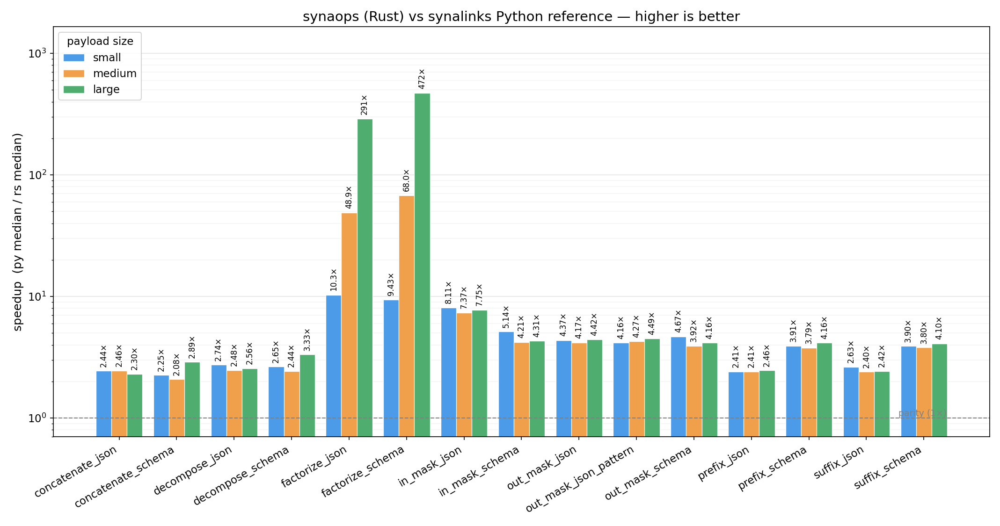
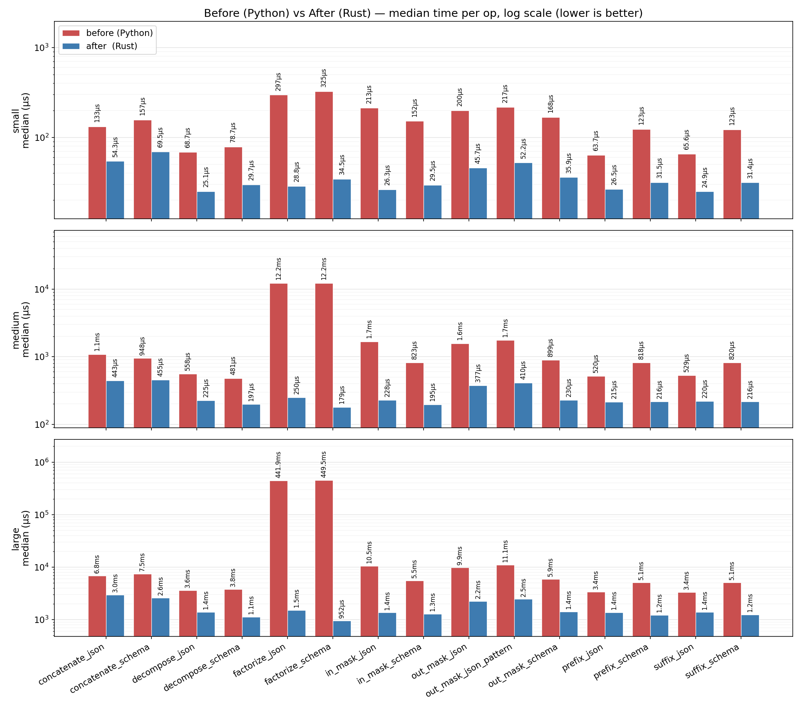

# synaops

Rust implementations of the JSON and JSON-schema operations used by
[synalinks](https://github.com/SynaLinks/synalinks), exposed to Python as a
PyO3 extension module (`synaops`).

The goal is a drop-in, faster replacement for the equivalent pure-Python
helpers. Input/output types are plain Python `dict` / `list` / scalars — the
boundary is handled via [`pythonize`](https://crates.io/crates/pythonize), so
callers do not need to know there is Rust underneath.

Parity with the Python reference is asserted on every op and payload size
(see `bench/test_parity.py`). Headline speedups on realistic payloads:
**~470× on `factorize_schema`**, **~290× on `factorize_json`** at 600 keys,
4–8× on masking ops, 2–4× on simple key rewrites. Full table below.

## Build

```bash
pip install maturin
maturin develop --release   # builds and installs into the active venv
```

## Python API

```python
import synaops
```

### JSON object operations

| Function | Signature | Description |
|---|---|---|
| `prefix_json` | `(json, prefix)` | Prepend `prefix_` to every top-level key. |
| `suffix_json` | `(json, suffix)` | Append `_suffix` to every top-level key. |
| `concatenate_json` | `(json1, json2)` | Merge two objects; on key collision append `_1`, `_2`, … to disambiguate. |
| `factorize_json` | `(json)` | Group keys sharing a singular base into a single array under the plural key. Inverse of `decompose_json`. |
| `decompose_json` | `(json)` | Expand plural-keyed array properties into individual singular-keyed properties with numerical suffixes. Inverse of `factorize_json`. |
| `out_mask_json` | `(json, mask=None, pattern=None, recursive=True)` | Drop keys whose base name is in `mask` or whose base name matches the regex `pattern`. Numerical suffixes are ignored when matching. |
| `in_mask_json` | `(json, mask=None, pattern=None, recursive=True)` | Keep only the keys whose base name is in `mask` or matches `pattern`. In recursive mode, arrays are preserved and their object items are filtered in place. |

### JSON schema operations

Operate on JSON-Schema-shaped dicts (`properties`, `required`, `$defs`, `type`, …).

| Function | Signature | Description |
|---|---|---|
| `prefix_schema` | `(schema, prefix)` | Prepend `prefix_` to every property key and update `title` / `required` accordingly. |
| `suffix_schema` | `(schema, suffix)` | Append `_suffix` to every property key and update `title` / `required` accordingly. |
| `concatenate_schema` | `(schema1, schema2)` | Merge two schemas (properties, `required`, `$defs`); on key collision append numeric suffixes and regenerate titles. |
| `factorize_schema` | `(schema)` | Group similar singular-keyed properties into array-typed plural-keyed properties; folds heterogeneous `items` into `anyOf`. |
| `decompose_schema` | `(schema)` | Expand plural-keyed array properties into a single singular-keyed property carrying the `items` schema. |
| `out_mask_schema` | `(schema, mask=None, pattern=None, recursive=True)` | Remove properties whose base name is in `mask` or matches `pattern`. With `recursive=True`, descends into nested object/array properties and `$defs`, then prunes `$defs` entries no longer referenced. |
| `in_mask_schema` | `(schema, mask=None, pattern=None, recursive=True)` | Keep only properties whose base name is in `mask` or matches `pattern`. Same recursive/`$defs`-pruning behavior as `out_mask_schema`. |
| `standardize_schema` | `(schema)` | Placeholder for schema normalization (currently identity). |

> `is_object`, `is_array`, `is_schema_equal`, `contains_schema` are intentionally **not** ported. They are single-key lookups or dict comparisons whose cost is dominated by the PyO3 / dict-conversion boundary, so the pure-Python versions in synalinks are faster.

## Matching semantics

Both `*_mask_*` families and `factorize_*` / `decompose_*` rely on the NLP
helpers in `nlp_utils.rs`: they strip trailing numerical suffixes
(`answer_3` → `answer`) and normalize singular/plural forms
(`answers` ↔ `answer`) before comparing keys. The `pattern` argument is a
regular expression matched via substring search against the base key (same
semantics as Python's `re.search`).

## Benchmark

Measured on realistic payloads: nested objects, arrays of `$ref`-based
objects, schema `$defs`. Three payload sizes (12, 96, 600 top-level keys).
Parity with the Python reference is verified before each timing run
(`pytest bench/test_parity.py`, 45/45 pass).

### Speedup summary

Ratio `py_median / rs_median` per op. Higher is better; dashed line is parity (1×).



| Operation | small (12) | medium (96) | large (600) |
|---|---:|---:|---:|
| `factorize_schema` | 9.43× | 68.0× | 472× |
| `factorize_json` | 10.3× | 48.9× | 291× |
| `in_mask_json` | 8.11× | 7.37× | 7.75× |
| `out_mask_json_pattern` | 4.16× | 4.27× | 4.49× |
| `out_mask_json` | 4.37× | 4.17× | 4.42× |
| `in_mask_schema` | 5.14× | 4.21× | 4.31× |
| `out_mask_schema` | 4.67× | 3.92× | 4.16× |
| `prefix_schema` | 3.91× | 3.79× | 4.16× |
| `suffix_schema` | 3.90× | 3.80× | 4.10× |
| `decompose_schema` | 2.65× | 2.44× | 3.33× |
| `concatenate_schema` | 2.25× | 2.08× | 2.89× |
| `decompose_json` | 2.74× | 2.48× | 2.56× |
| `prefix_json` | 2.41× | 2.41× | 2.46× |
| `suffix_json` | 2.63× | 2.40× | 2.42× |
| `concatenate_json` | 2.44× | 2.46× | 2.30× |

`factorize_*` scales super-linearly because the Python reference does
repeated O(n) key scans per group; the Rust path groups in a single pass.
Simple key rewrites (`prefix_*`, `suffix_*`, `concatenate_*`) are bounded
by the PyO3 dict-conversion boundary, which is why they cluster around 2–4×.

### Before (Python) vs After (Rust) — absolute medians

Log scale, lower is better. Rows are the three payload sizes.



See `bench/README.md` for the harness, payload shapes, and how to
regenerate these charts.

## Development

```bash
cargo test              # run Rust unit tests
maturin develop         # install debug build into venv
maturin develop --release

# Parity + performance against the Python reference impl
pytest bench/test_parity.py -v
pytest bench/test_bench.py --benchmark-save=latest
python bench/plot.py    # writes bench/speedup.png
```

## License

Apache-2.0
